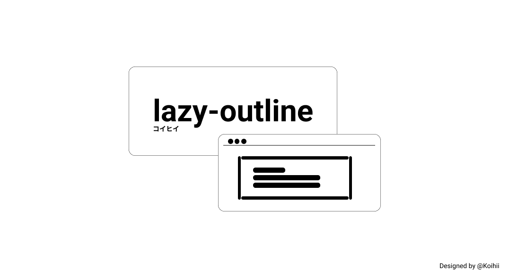
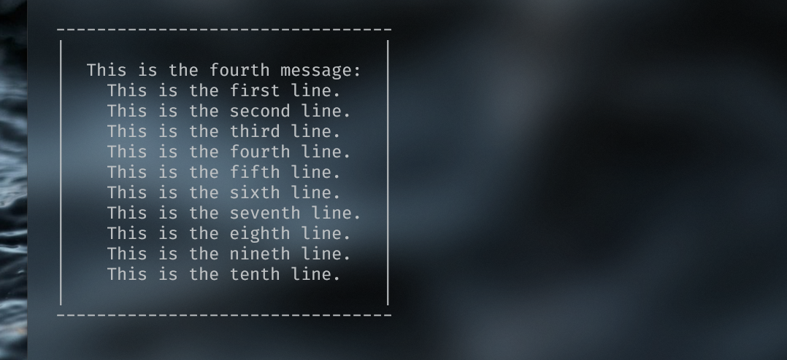

# lazy-outline



A simple, lightweight plugin for outlining stuffs to your terminal.

Basically, the plugin will work like this image.



## Installation

Install this plugin by using this command:

```bash
$ npm install @koihii/lazy-outline
```

## Usage

`lazy-outline` supports both `ESModule` and `CommonJS`. You can either:

```js
// with commonjs
const lazyOutline = require('@koihii/lazy-outline')

// with esmodule.
import lazyOutline from '@koihii/lazy-outline'
```

After importing this plugin, simply use it like this.

```js
const lazyOutline = require('@koihii/lazy-outline')

const LOGS = [
  'This is the first message:',
  '  This is the second message.',
  '  This is the third message.',
]

lazyOutline(LOGS)
```

Follow [this link](https://github.com/Koihii/lazy-outline/blob/main/test/testCases.js)

`lazy-outline` has these configuration options:

- margin (array of numbers)
- marginTop (number)
- marginLeft (number)
- marginBottom (number)
- marginRight (number)
- padding (array of numbers)
- paddingTop (number)
- paddingLeft (number)
- paddingBottom (number)
- paddingRight (number)

By default, `lazy-outline` sets `margin: [2, 2]` and `padding: [2, 2]`, but you can set configuration on your own.

```js
const CONFIG = {
  margin: [4, 2],
  marginLeft: 3,
  padding: [2, 3],
  paddingTop: 4,
}

lazyOutline(LOGS, CONFIG)
```

## Credits

`lazy-outline` is created to support my other plugins.

## License

[MIT](LICENSE)
